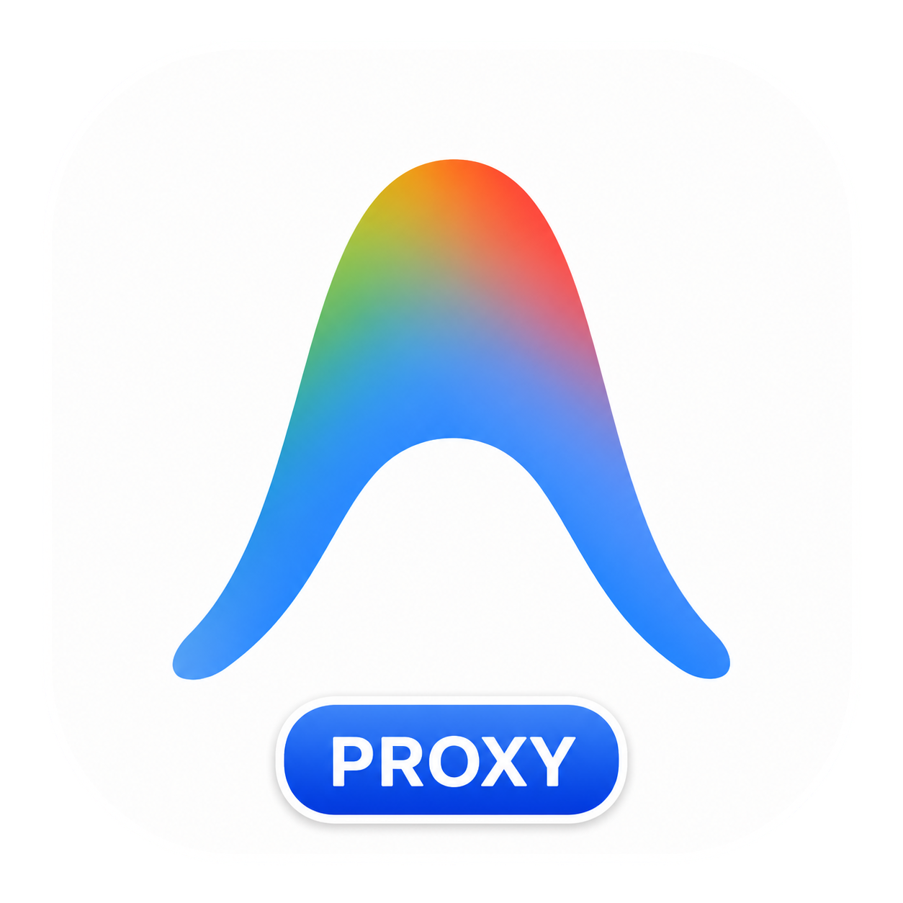

# Antigravity-Proxy for macOS

<p align="center">
  
</p>

专为 macOS 上的 Antigravity 准备：在不打开 Clash TUN 的情况下，尽量让 Antigravity 走本机代理。

本项目的整体思路参考 Windows 项目 [yuaotian/antigravity-proxy](https://github.com/yuaotian/antigravity-proxy)：通过注入组件拦截网络连接，让 Antigravity 相关流量透明转发到本机代理。区别是 Windows 版使用 DLL 注入，macOS 版使用 `DYLD_INSERT_LIBRARIES` 注入 dylib，并生成一个可双击启动的 `Antigravity-Proxy.app`。

---

## 目录 / Table of Contents

- [项目介绍 / Introduction](#项目介绍--introduction)
- [快速开始 / Quick Start](#快速开始--quick-start)
- [自定义图标 / Custom Icon](#自定义图标--custom-icon)
- [更新 Antigravity / Update](#更新-antigravity--update)
- [停止后台进程 / Stop](#停止后台进程--stop)
- [工作原理 / How It Works](#工作原理--how-it-works)
- [本地构建 / Build](#本地构建--build)
- [本地测试 / Test](#本地测试--test)
- [故障排查 / Troubleshooting](#故障排查--troubleshooting)
- [限制 / Limitations](#限制--limitations)
- [许可证 / License](#许可证--license)

---

## 项目介绍 / Introduction

mac-antigravity-proxy 会从 `/Applications/Antigravity.app` 复制一份 Antigravity，生成代理版：

```text
Antigravity-Proxy.app
```

生成后的 App 可以直接双击，也可以移动到 `/Applications` 文件夹里使用。原版 `/Applications/Antigravity.app` 不会被修改。

它主要解决这些场景：

- Antigravity 不读取 macOS system proxy。
- Clash Verge 开启 system proxy 后，Antigravity 仍然无法登录或无法连接。
- 不想长期打开 TUN，只想让 Antigravity 走本机代理。

如果你已经使用 Clash TUN、Surge 增强模式、Proxifier 或其他全局/按进程代理方案，并且 Antigravity 工作正常，就不需要这个工具。

---

## 快速开始 / Quick Start

> 只想让 Antigravity 立刻能用，看这一节就够了。

### Step 1: 确认 Antigravity 和代理

请先确认：

- Antigravity 已安装在 `/Applications/Antigravity.app`。
- Clash Verge 或其他代理软件正在运行。
- 已安装 Xcode Command Line Tools：

```bash
xcode-select --install
```

### Step 2: 生成 Antigravity-Proxy.app

#### 情况 A：你的 Clash 端口是 7890

如果你使用 Clash Verge 默认 mixed port `7890`，直接运行：

```bash
./prepare-app-copy.sh --replace
```

脚本会使用：

- dylib hook 代理：`socks5://127.0.0.1:7890`
- 子进程环境变量代理：`http://127.0.0.1:7890`

这是 Clash Verge 默认 mixed port 下最省事的配置。

如果你也是 `7890` 端口，并且不想自己构建或生成 App，可以直接到本仓库的 [Releases](https://github.com/OkamiFeng/mac-antigravity-proxy-dylib/releases) 下载我构建好的 `Antigravity-Proxy.app`，解压后双击即用。

#### 情况 B：你的 Clash 端口不是 7890

如果你使用的是其他 mixed port，例如 `7893`：

```bash
./prepare-app-copy.sh --replace \
  --proxy socks5://127.0.0.1:7893 \
  --env-proxy http://127.0.0.1:7893
```

如果你使用的是独立 SOCKS5 端口，例如 `7891`：

```bash
./prepare-app-copy.sh --replace \
  --proxy socks5://127.0.0.1:7891 \
  --env-proxy socks5://127.0.0.1:7891
```

参数说明：

- `--proxy`：给 dylib hook 使用，目前需要 SOCKS5。
- `--env-proxy`：写入 `HTTP_PROXY/HTTPS_PROXY/ALL_PROXY`，用于覆盖不走 hook 的子进程。
- `--replace`：删除已有 `Antigravity-Proxy.app` 后重新生成。

### Step 3: 启动

生成完成后，直接双击当前目录里的：

```text
Antigravity-Proxy.app
```

也可以把它移动到 `/Applications`：

```bash
mv Antigravity-Proxy.app /Applications/
```

之后双击 `/Applications/Antigravity-Proxy.app` 即可。App 运行所需的内层 Antigravity 副本、dylib、配置和图标都已经包含在 bundle 内部。

---

## 自定义图标 / Custom Icon

仓库里的 `icon.png` 就是生成 `Antigravity-Proxy.app` 时使用的图标。

如果你想换成自己的图标：

1. 用新的 PNG 图片替换仓库根目录的 `icon.png`。
2. 重新生成 App：

```bash
./prepare-app-copy.sh --replace
```

脚本会自动把 `icon.png` 转成 `.icns`，并写入：

- 外层 `Antigravity-Proxy.app`。
- 内层 Antigravity 副本。
- Electron Helper。
- 内层 `app.asar` 的根目录 `icon.png`。

最后一步是为了避免 Electron 加载完成后调用 `app.dock.setIcon(.../icon.png)`，把 Dock 图标切回原版图标。

如果 macOS 仍显示旧图标，可能是图标缓存，可以退出 Antigravity 后运行：

```bash
killall Dock
```

---

## 更新 Antigravity / Update

代理版 App 内部包含一份 Antigravity 副本，所以 Antigravity 更新后建议这样做：

1. 先用原版 `/Applications/Antigravity.app` 完成更新。
2. 退出 Antigravity。
3. 重新生成代理版：

```bash
./prepare-app-copy.sh --replace
```

不建议依赖代理版内部副本自动更新。

---

## 停止后台进程 / Stop

正常关闭代理版窗口后，launcher 会自动退出后台进程。

如果遇到当前目录生成的代理版 App 残留后台进程，可以运行：

```bash
./stop-antigravity-proxy.sh
```

如果你已经把 App 移动到 `/Applications`，通常直接从菜单栏退出 Antigravity 即可；上面的停止脚本主要面向仓库目录里生成的 `Antigravity-Proxy.app`。

---

## 工作原理 / How It Works

`prepare-app-copy.sh` 会做这些事：

- 从 `/Applications/Antigravity.app` 复制一份 Antigravity 到 `Antigravity-Proxy.app/Contents/Resources/Antigravity.app`。
- 构建并放入 `libantigravity_proxy.dylib`。
- 构建并放入 `AntigravityProxyLauncher` 作为外层 App 的入口。
- 对内层 Antigravity 副本做 ad-hoc 重签名，添加允许 `DYLD_INSERT_LIBRARIES` 的 entitlement。
- 写入 `proxy.env`，双击 App 时自动设置代理环境变量。
- 替换外层、内层和 Electron Helper 的图标。

注入库主要拦截：

- `getaddrinfo()`：给域名分配 `198.18.0.0/15` 范围内的 FakeIP，并保存 FakeIP 到域名的映射。
- `connect()`：遇到 FakeIP 时连接本机 SOCKS5 代理，并用 SOCKS5 domain CONNECT 请求原始域名；其他 TCP 目标按 IP CONNECT 转发。

`language_server` 这类 Go 子进程可能不走 libc hook，所以 launcher 同时设置 `HTTP_PROXY`、`HTTPS_PROXY`、`ALL_PROXY` 等环境变量。

### 为什么不直接注入原版 App

macOS 上的 Antigravity 原版 App 开启了 hardened runtime，并且没有允许动态库注入所需的 entitlement。直接对 `/Applications/Antigravity.app` 使用 `DYLD_INSERT_LIBRARIES` 通常会被系统拦截。

所以本项目不修改原版 App，而是生成一份代理版副本。

---

## 本地构建 / Build

`prepare-app-copy.sh` 会在缺少构建产物时自动运行 `build.sh`。也可以手动构建：

```bash
./build.sh
```

生成物位于 `build/`，不会提交到 Git。

---

## 本地测试 / Test

这个测试不依赖 Antigravity，只验证 FakeIP 和 SOCKS5 CONNECT 是否工作：

```bash
./build.sh
./tests/socks5_capture.py 18081
```

另开一个终端：

```bash
AG_PROXY=socks5://127.0.0.1:18081 \
AG_PROXY_LOG=1 \
DYLD_INSERT_LIBRARIES="$PWD/build/libantigravity_proxy.dylib" \
./build/test_client login.example.test 443
```

成功时，SOCKS5 测试服务会输出：

```text
captured login.example.test:443
```

---

## 故障排查 / Troubleshooting

### GUI 仍显示需要登录

先看 Clash 日志中这些域名是否走代理：

- `accounts.google.com`
- `oauth2.googleapis.com`
- `www.googleapis.com`
- `daily-cloudcode-pa.googleapis.com`
- `generativelanguage.googleapis.com`

如果看到 `language_server` 仍然直连，可以查看：

```bash
tail -n 120 ~/Library/Logs/Antigravity/language_server.log
```

如果日志里出现 `dial tcp ... i/o timeout`，通常说明 Go 子进程没有拿到代理环境变量。优先使用 Clash mixed port，并明确传入 `--env-proxy`：

```bash
./prepare-app-copy.sh --replace \
  --proxy socks5://127.0.0.1:7890 \
  --env-proxy http://127.0.0.1:7890
```

### 原版 Antigravity 打不开

不要同时运行原版和代理版。Antigravity / Electron 可能会使用同一个用户数据目录和单实例锁；如果代理版已经在运行，双击原版可能只是激活现有进程。

处理方式：

1. 完全退出 Antigravity。
2. 如果要用 TUN，打开原版 `/Applications/Antigravity.app`。
3. 如果不用 TUN，打开 `Antigravity-Proxy.app`。

---

## 限制 / Limitations

- 只处理 TCP `connect()`，不处理 UDP/QUIC。
- dylib hook 目前只支持 SOCKS5 代理。
- `--proxy` 的代理地址建议使用数字 IP，例如 `127.0.0.1`。
- 如果 Antigravity 使用 Network.framework、内置 DNS、DoH 或不经过 libc socket API 的路径，可能绕过 hook。
- 代理版 App 是重签名副本，自动更新不可靠；更新请优先走原版 App 后重新生成代理版。
- 自动退出后台进程依赖窗口检测，macOS 可能提示授予自动化权限。

---

## 许可证 / License

MIT License。详见 [LICENSE](LICENSE)。
